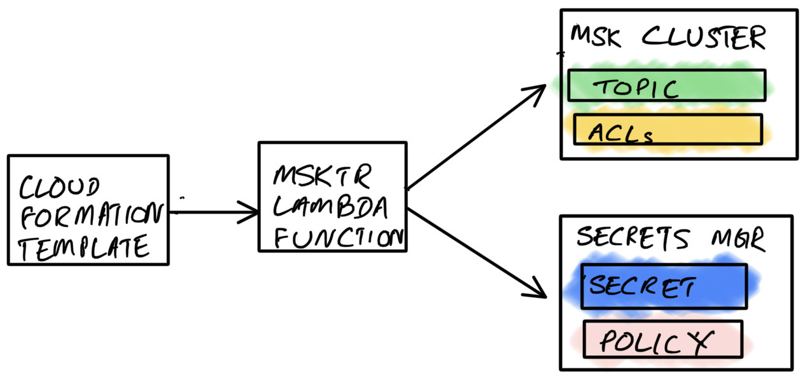

# TR - MSK Topic Resource for CloudFormation

[](https://goreportcard.com/report/github.com/aws-samples/amazon-msk-topic-resource)

## Summary
TR is a custom CloudFormation resource that can be used to create and manage Kafka topics in MSK clusters. With TR, you can deploy and manage Kafka topics in the same way you manage other application infrastructure. Deploying MSK topics using TR has the following benefits.
- Manage topic infrastructure as code
- Provide a self-servicing model for large teams to create and use MSK topics without granting administrative access to MSK 
- Include MSK topics in the all-or-nothing deployment lifecycle provided by CloudFormation
- Provide a familiar developer experience for modelling MSK topics
- Support the operation of large number of topics potentially spanning across multiple MSK clusters

Below is an example of what an MSK topic looks like in a CloudFormation template.

```
AWSTemplateFormatVersion: "2010-09-09"
Description: >
  This CloudFormation template creates a MSK topic
  using tr.

Resources:
  AwesomeTopic:
    Type: Custom::MSKTopic
    Properties:
      ServiceToken: "<Custom Resource Lambda function ARN>"
      Name: "awesome-topic"
      Partitions: 3
      ReplicationFactor: 3
      Config:
        "min.insync.replicas": "2"
        "retention.ms": "3600000"
        "message.format.version": "3.0-IV1"
        "unclean.leader.election.enable": "false"
      ClusterArn: "<MSK Cluster ARN>"
      Users:
        - 
          Username: charlie
          Permissions: [ READ, WRITE ]
        -
          Username: debby
          Permissions: [READ]

Outputs:
  AwesomeTopic:
    Description: "Topic name"
    Value: !Ref AwesomeTopic 
```

Complete schema definition for TR resource is listed below.

## Properties

 - <b id="#ServiceToken">ServiceToken</b> `required`
    - ARN of TR custom resource Lambda function. This can be found in the output of CloudFormation stack used to install TR in your account.
    - Type: `string`
    - Update requires: [Update with No Interruption](https://docs.aws.amazon.com/AWSCloudFormation/latest/UserGuide/using-cfn-updating-stacks-update-behaviors.html#update-no-interrupt)
 - <b id="#Name">Name</b> `required`
    - Topic name. TR will append a short, random string to ensure that topic names created via different stacks do not conflict. All topics created within a stack have the same suffix.
    - Type: `string`
    - Update: Not supported
- <b id="#DeletionPolicy">DeletionPolicy</b>
    - Specifiy what to be done to the topic and data when the CloudFormation stack is deleted
    - Type: `string`
      - The value is restricted to the following: <br/>
        1. "DELETE" - Delete the topic and relinquish storage resources used for topic data (default)
        2. "RETAIN" - Retains the topic and data in MSK. You will need to manage the topic manually after CloudFormation stack is deleted.
    - Update requires: [Update with No Interruption](https://docs.aws.amazon.com/AWSCloudFormation/latest/UserGuide/using-cfn-updating-stacks-update-behaviors.html#update-no-interrupt) 
 - <b id="#Partitions">Partitions</b> `required`
	 - Number of partitions in this topic
	 - Type: `integer`
   - Update: Not supported
 - <b id="#ReplicationFactor">ReplicationFactor</b> `required`
	 - Replication factor for the topic
	 - Type: `integer`
   - Update: Not supported
 - <b id="#ClusterArn">ClusterArn</b> `required`
	 - MSK cluster ARN
	 - Type: `string`
   - Update: Not supported
 - <b id="#Config">Config</b>
	 - Additional topic configuration properties. Any Kafka topic property such as `min.insync.replicas` or MSK specific topic property such as `local.retention.ms` can be specified here.
	 - Type: `object`
 - <b id="#Users">Users</b>
	 - List of users and their permissions
	 - Type: `array`
		 - **Items**
		 - &#36;ref: [User](#user)

## Definitions

### User
User with access to MSK topic
 - Type: `object`
 - **Properties**
	 - <b id="#User/Username">Username</b> `required`
		 - Username for the user. TR will append a short random string to ensure that usernames created via different stacks do not conflict. All usernames created within a stack have the same suffix.
		 - Type: `string`
	 - <b id="#User/Arn">Arn</b>
		 - ARN of an IAM entity that should have access to the SecretsManager secret containing credentails for the user. Specifying an IAM entity used by either the producers or consumers will give them the ability to discover credentials at runtime.
		 - Type: `string`
	 - <b id="#User/Permissions">Permissions</b> `required`
		 - Operations allowed for this user. Available options are READ/WRITE.
		 - Type: `array`
			 - **Items**
			 - Type: `string`
			 - The value is restricted to the following: 
				 1. "READ"
				 2. "WRITE"

## Setup

To install Install TR in the desired AWS account use the following Make target. It will compile Go source code, output the binary and a CloudFormation template versioned using the latest git commit SHA in the main branch, upload them to a specified S3 bucket and finally run the CloudFormation template to setup the Lambda function.
TR requires access to MSK clusters running within VPC. Therefore you will need to provide Subnet IDs and Security Group IDs to the installation command.

```
make deploy bucket=<bucket> key=<key> security-group-ids=<security-group-ids> subnet-ids=<subnet-ids>

-bucket string 
  S3 bucket where compiled Lambda function binary is uploaded

-key string 
  S3 bucket path where compiled Lambda function binary is uploaded

-security-group-ids string
  Comma separated list of Security Group Ids to be assigned to Lambda function. Ensure that security group allows communication to MSK cluster.

-subnet-ids string 
  Comma separated list of subnet ids to run Lambda function.
```

```
# Command output
[
    [
        {
            "OutputKey": "MSKTopicResourceServiceToken",
            "OutputValue": "arn:aws:lambda:ap-southeast-2:111222333444:function:tr-Function-IW0eHw888gd8",
            "Description": "Service token for creating managing MSK topics",
            "ExportName": "MskTopicResourceServiceToken"
        }
    ]
]
```

## Prerequisits
### MSK Cluster IAM Authentication
You must enable IAM authentication in MSK cluster prior to deploying any TR resources. TR uses IAM authentication for all topic management activities. This approach provides the ability to audit topic management activities via CloudTrail. Enabling IAM authentication does not impact the authetication mode used in producers and consumers.

### MSK Cluster SASL/SCRAM Authentication
If you are planning to manage access to your topics via TR template, you must enable SASL/SCRAM authentication in MSK cluster. Users created for topics are creted as SASL/SCRAM users in MSK. 

### KMS Key
SASL/SCRAM user credentials provisioned via TR are stored in Secrets Manager. MSK requires that they are encryped using a custom KMS key. MSK cluster administrators must provision this key and store its ARN as a tag in MSK cluster. TR looks for a tag with the key - `TR-KMS-KEY`.

## How it Works

You can find the ARN for TR function in the output of setup command. CloudFormation authors must specify that ARN as the `ServiceToken` property in their templates. This will notify CloudFormation that it should invoke TR during CRUD operations for the stack. Once TR successfully completes its workflow for required operation, CloudFormation keeps track of the resource as part of the stack.



Let's take a closer look at what is done by TR below.

- Create an MSK topic in MSK cluster specified by `ClusterArn` property
    Topics created by TR are owned by the creator of the stack. In order to avoid naming conflicts, TR automatically appends a short, random, alpha numeric token to topic name.

- For each user
    - Create a secret in SecretsManager with a username and a password. A strong password is automatically generated.
    - Associate the secret with MSK cluster
    - Create Kafka ACLs so that the user is only able to perform specified actions
    - Optionally, update the resource policy of secret so that it can be read by an IAM user specified by `Arn` property. This is useful for usecases where username and password for accessing a topic has to be automatically discoverable by consumer and producer applications.

Once the CloudFormation stack is successfully created, producers and consumers can access the topic using SASL/SCRAM authentication.

### Deleting a CloudFormation Stack
By default ACLs and any associated secrets in SecretsManager are deleted when CloudFormation stack containing the topic is deleted. However the topic and its data is retained in MSK. Default behaviour is chosen to avoid accidently deleting data when working with CloudFormation stacks. When you are certain that you want to delete topic data from MSK, set [DeletionPolicy](#DeletionPolicy) attribute to `DELETE` and run `aws cloudformation deploy ...` command followed by `aws cloudformation delete ...` command.

## IAM Authentication for Producers and Consumers
Users specified in CloudFormation template are created as SASL/SCRAM users in MSK. TR creates the credentials in SecretsManager and associates them with MSK cluster. If your MSK clients are using IAM authentication or you are using MSK Serverless (which currently only supports IAM authentication), use TR for managing topics but configure access using standard CloudFormation constructs for IAM.

## Development
TR is written with ❤ in Go. It is made possible by some amazing Go packages. 
- [aws-sdk-go-v2](https://github.com/aws/aws-sdk-go-v2)
- [franz-go](https://github.com/twmb/franz-go) A pure go client library for Kafka with IAM authentication support️.

