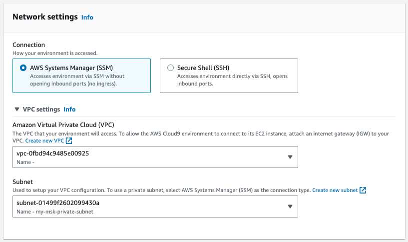
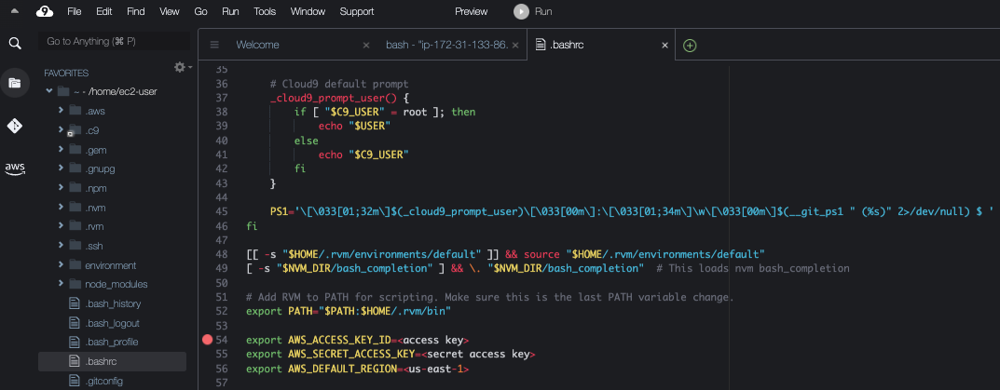

# TR - Tutorial

By Christal Poon and Toh Yun Yun

## Installation Guide

### Go Language
MSK TR is written in Go. 

Refer to [https://go.dev/dl/](https://go.dev/dl/) for downloading Go for your OS

## Topic Resource Tutorial

### Section 1

<b>Creating the VPC Environment</b>
To create a secure environment for your workloads, a Virtual Private Cloud (VPC) needs to be created. When you create a Lambda function without a VPC configuration, it’s automatically available in all Availability Zones within the Region. When you set up VPC access, you choose which Availability Zones the Lambda function can use. As a result, to provide continued high availability, ensure that the function has access to at least two Availability Zones (recommended).


1. Click on `Services` in the top left corner of the console, and select `VPC`
2. Click `Create VPC` to create your own VPC.
    1. Select `VPC only` as Resources to Create
    2. Choose a name for your VPC (e.g. my-msk-vpc)
    3. Provide an IPv4 CIDR (e.g. 10.0.0.0/16)
    4. Leave the rest of the settings as they are, and click `Create VPC`
3. Select `Subnet` under Virtual private Cloud in the left pane
4. Click `Create Subnet` to create four subnets: my-public-subnet-1, my-public-subnet-2, my-public-subnet-3, and my-private-subnet spanning across three availability zone. Note that your public subnets should be in three different Availability Zones (AZs)
    1. Choose the VPC that you created in Step 2 as VPC ID
    2. Give your subnet a name
    3. Choose an availability zone
    4. Input a suitable IPv4 CIDR block
    5. Click Add New Subnet and repeat Steps 4a-4d until there is a total of four new subnets
5. Select on `Internet Gateway` on the left pane
6. Click on `Create internet gateway`
    1. Name your internet gateway (e.g. my-internet-gateway)
    2. Scroll to the bottom and click `Create internet gateway`
7. Select NAT Gateway in the left pane
8. Click on Create NAT Gateway
    1. Name your NAT Gateway (e.g. my-nat-gateway)
    2. Choose a Subnet that is public (e.g. my-public-subnet-1)
    3. Choose `Public` as Connectivity Type
    4. Click `Allocate Elastic IP` 
    5. Scroll to the bottom and click `Create NAT Gateway`
9. Select `Route Table` in the left pane
10. Click on `Create route table`
    1. Name your first route table: rt-public-subnets
    2. Select the VPC you created your subnets in
    3. Click on `Create route table`
    4. Click on your new route table and click `Edit Routes`
    5. Pick `0.0.0.0/0` as destination and the internet gateway (e.g. igw....) that you created in this VPC as the target
    6. Click `Save Changes`
    7. On the top right hand corner, click on `Actions` and `Edit Subnet Associations`
    8. Select `my-public-subnet-1`, `my-public-subnet-2`, `my-public-subnet-3`
    9. Click Save Changes
11. Create another `Route Table` by going back to Route Table and Clicking `Create route table`
    1. Name your second route table: rt-private-subnet
    2. Select the VPC you created your subnets in
    3. Click on `Create route table`
    4. Click on your new route table and click `Edit Routes`
    5. Pick `0.0.0.0/0` as destination and the NAT Gateway (e.g. nat....) that you created in this VPC as the target
    6. Click `Save Changes`
    7. On the top right hand corner, click on `Actions` and `Edit Subnet Associations`
    8. Select `my-private-subnet`
    9. Click `Save Changes`

<b>Create the security group for the Amazon MSK cluster</b>

1. Click on `Services` in the top left corner of the console, and select `EC2`
2. Select `Security Groups` in the left pane
3. Click `Create Security Group`
4. Fill out the form as follows:
    1. Security group name: (e.g. my-msk-sg)
    2. Description: Access to the Kafka service on the MSK cluster
    3. VPC: (e.g. my-msk-vpc)
5. Create rules
    1. Click `Add rule` under the <b>Inbound rules</b> section. Use:
        1. Type: All Traffic
        2. Protocol: All
        3. Port range: All
        4. Source: Custom - In the search bar dropdown, choose this particular security group (If you do not see the new security group name, create the security group first, go to ‘Edit Inbound Rules’ and the security group can now be seen specified)
    2. Click `Add rule` under the <b>Outbound rules</b> section. Use:
        1. Type: All Traffic
        2. Protocol: All
        3. Port range: All
        4. Source: Custom - 0.0.0.0/0

<b>Create the Amazon MSK Cluster</b>

1. Click on `Services` in the top left corner of the console, and select `MSK`
2. Select `Custom create` for the <b>Creation method</b>
3. Enter the cluster name - (e.g. my-msk-vpc)
4. Select `Provisioned` as Cluster Type
5. Select the version of Kafka you want to run on the cluster (ex: 2.8.1)
6. Brokers
    1. Select `kafka.m5.large` as the Broker Instance Type
    2. Select the number of zones (availability zones) you want to deploy in to (3)
    3. Enter `1` for the number of brokers per zone
7. Storage
    1. Enter `1000` GiB
8. Cluster Configuration
    1. Select `Amazon MSK default configuration`
9. Networking
    1. Select the VPC you want to deploy your cluster in (`MSKVPC` if you created the VPC using our provided CloudFormation)
    2. Select `xx-xxx-xa` for the first AZ, then the private subnet
    3. Select `xx-xxx-xb` for the second AZ, and the appropriate private subnet 
    4. Select `xx-xxx-xc` for the third AZ, and the appropriate private subnet 
    5. In the ‘Security groups in Amazon EC2’ section, click `Browse` and select the `my-msk-sg` security group we created in the previous section
10. Click `Next` to move onto Security controls
11. Access Control Methods
    1. Check the `IAM role-based authentication` box
    2. Check the `SASL/SCRAM authentication` box 
12. Encryption
    1. Select `Use AWS-managed key` as Encryption at Rest. This means Amazon MSK will manage the encryption key for you
    2. TLS encryption is automatically enabled as the access control methods we have selected are IAM or SASL/SCRAM
13. Click `Next` to move onto Monitoring
14. Amazon CloudWatch metrics for this cluster
    1. Select `Enhanced partition-level monitoring`
15. Open monitoring with Prometheus
    1. Check the `Enable open monitoring with Prometheus` box 
    2. Select `JMX Exporter` and `Node Exporter` as Prometheus exporters
16. Leave the checkboxes under Broker log delivery as they are
17. Click `Next`. Scroll to the bottom and click `Create cluster` . Your cluster is being built. This can take 10-15 minutes.

### Section 2

Clone the repository into your local device from this link: [https://github.com/aws-samples/amazon-msk-topic-resource](https://github.com/aws-samples/amazon-msk-topic-resource)

#### 2.1 For Internal Users

These setup steps are for internal users who are using this resource. 

- Ensure that you are connected to the VPN
- On the terminal, run the following command to sign in and authenticate: `mwinit`
- After authenticating via Midway, run the following command to sign in with your credentials in the terminal: `isengardcli assume`
    - Key in the region that the s3 bucket have been set up in. eg ap-southeast-1
    - Select the account to deploy the CloudFormation template in

#### 2.2 For External Users
#### 2.2.1 Running the resource on your local terminal

For external users, ensure that your authenticated in the AWS CLI before proceeding with the following steps

1. In the terminal, navigate to the location where the github file is stored in and run: 
    `make deploy bucket=<bucket> key=<key> security-group-ids=<security-group-ids> subnet-ids=<subnet-ids>`
    1. Replace the arguments in `< >` with the correct resource names in your environment, e.g.  `make deploy bucket='my-msk-bucket' key='dist/' security-group-ids='sgr-016232ff964122b8e' subnet-ids='subnet-04179fbc1b5ea2e0e','subnet-021d0fb3af4b059ba'`
    2. If you are running into problems using GoLang 1.13 in your dev environment, you can opt-out of the proxy functionality by running `go env -w GOPRIVATE=*` or `go env -w GOPROXY=direct` depending on your version
2. A successful CloudFormation deployed will likened the following code: 

```
GOOS=linux GOARCH=amd64 go build -o build/tr 
chmod 0644 build/tr
zip -j build/tr.zip build/tr
 adding: tr (deflated 52%)
fatal: not a git repository (or any of the parent directories): .git
mv build/tr.zip "build/tr_.zip" 
cp cfn-stack.yaml build/cfn-stack-.yaml
aws s3 cp "build/tr_.zip" "s3://msk-topic-stuff/dist//tr_.zip"
upload: build/tr_.zip to s3://msk-topic-stuff/dist//tr_.zip 
aws s3 cp cfn-stack.yaml "s3://msk-topic-stuff/dist//cfn-stack-.yaml"
upload: ./cfn-stack.yaml to s3://msk-topic-stuff/dist//cfn-stack-.yaml
Release s3://msk-topic-stuff/dist//tr_.zip
fatal: not a git repository (or any of the parent directories): .git
aws cloudformation deploy —template-file build/cfn-stack-.yaml —stack-name tr —capabilities=CAPABILITY_IAM —parameter-overrides S3Bucket=msk-topic-stuff S3Key="dist//tr_.zip" SecurityGroupIds=sg-096952d5038154bc4 SubnetIds=subnet-02d5e7f92958b7b81,subnet-09a19723cbc301b53

Waiting for changeset to be created..
Waiting for stack create/update to complete
Successfully created/updated stack - tr
aws cloudformation describe-stacks —stack-name tr —query "Stacks[].Outputs" | cat
[
    [
        {
 "OutputKey": "MSKTopicResourceServiceToken",
 "OutputValue": "arn:aws:lambda:ap-southeast-1:993742575548:function:tr-Function-FPhChnJBrazd",
 "Description": "Service token for creating managing MSK topics",
 "ExportName": "MskTopicResourceServiceToken"
        }
    ]
]
```

3. If you navigate to CloudFormation on your AWS Management Console, the Status of the stack ‘tr’ should be ‘CREATE_COMPLETE’, as seen in the screenshot below:


#### 2.2.2 Running the resource on AWS Cloud9 

For external users, ensure that you have an IAM user with Access Key enabled.

1. Go to IAM in the console. Under Access Management click on Users. 
2. If you have a user that you would like to use for the MSK TR but it does not have an Access Key attached to it, proceed to Step 6. If you would want to create a new user for the MSK TR or do not have any existing user, proceed to the next step. 
3. Click on the blue button “Add users”. Create a User name of your liking (replace `msk-tr-user` accordingly). Click `Next`. 


4. As we are creating an Admin User to oversee the MSK TR process, select `Attach policies directly` under Permissions options. 
5. Under Permissions policies, select `AdministratorAccess`. Click Next. `Click Create User`.


6. Click on the username of your newly created user. e.g. `msk-tr-user`. 
7. Click on Security credentials and click `Create access key`. 
8. Select `Command line Interface (CLI)`, then click Next and Create access key. 


9. Download the .csv file of your access key and secret access key. Click `Done` after you have saved your credentials.


10. Head over to Cloud9. 


11. Click on Create Environment
12. Name the environment as `msk-environment`, you can choose to change it accordingly.


13. Keep the New EC2 instance to its default settings.
14. Under Network settings, click on VPC settings. Leave the VPC as the default. For the Subnet, select the subnet that you will be deploying your msk cluster into. 



15. Click Create. 
16. Open up the newly created msk-environment. Give it a few minutes to load. 
17. Under Getting started, click on “Clone from Github”. Run the following command:
`git clone https://github.com/aws-samples/amazon-msk-topic-resource.git`
18. On the right of the msk-environment, click on the gear icon. Check the boxes `Show Home in Favorites` and `Show Hidden Files`. 


19. Expand the FAVORITES section and double click to open the .bashrc file. Add the following piece of code to the bottom of the file (Line 54-56). 
`export AWS_ACCESS_KEY_ID=<access key>`
`export AWS_SECRET_ACCESS_KEY=<secret access key>`
`export AWS_DEFAULT_REGION=<us-east-1>`
    1. Replace <access key> and <secret access key> with the keys obtained in Step 9. 
    2. Replace <us-east-1> with the region that the s3 bucket have been set up in. eg ap-southeast-1



20. Once completed, save the file and head over to the bash terminal located at the bottom. Run the following codes separately. 
    1. Point the directory to the MSK File. cd amazon-msk-topic-resource/
    2. `make deploy bucket=<bucket> key=<key> security-group-ids=<security-group-ids> subnet-ids=<subnet-ids>`
        1. Replace the arguments in < > with the correct resource names in your environment, e.g.  `make deploy bucket='my-msk-bucket' key='dist/' security-group-ids='sgr-016232ff964122b8e' subnet-ids='subnet-04179fbc1b5ea2e0e','subnet-021d0fb3af4b059ba'`
        2. Note: If you see the following error, you did not set up your .bashrc file properly. Head back to Step 19 to reconfigure again.

    `An error occurred (InvalidClientTokenId) when calling the DescribeStacks operation: The security token included in the request is invalid`
    `make: * [deploy] Error 255`

### Section 3

<b> Creating an MSK Topic </b>

If you do not already have a topic in your MSK cluster, run the sample template as shown below while replacing the highlighted portions with respective resource names in your AWS account.

```
AWSTemplateFormatVersion: "2010-09-09"
Description: >
  This CloudFormation template creates a MSK topic using tr.

Resources:
  AwesomeTopic:
    Type: Custom::MSKTopic
    Properties:
      ServiceToken: "<Insert your Custom Resource Lambda function's ARN here>"
      Name: "awesome-topic"
      Partitions: 3
      ReplicationFactor: 3
      Config:
        "min.insync.replicas": "2"
        "retention.ms": "3600000"
        "unclean.leader.election.enable": "false"
      ClusterArn: "<Insert your MSK Cluster's ARN here>"
      Users:
        - 
          Username: <Insert your IAM user here>
          Permissions: [ READ, WRITE ]

Outputs:
  AwesomeTopic:
    Description: "Topic name"
    Value: !Ref AwesomeTopic 
```